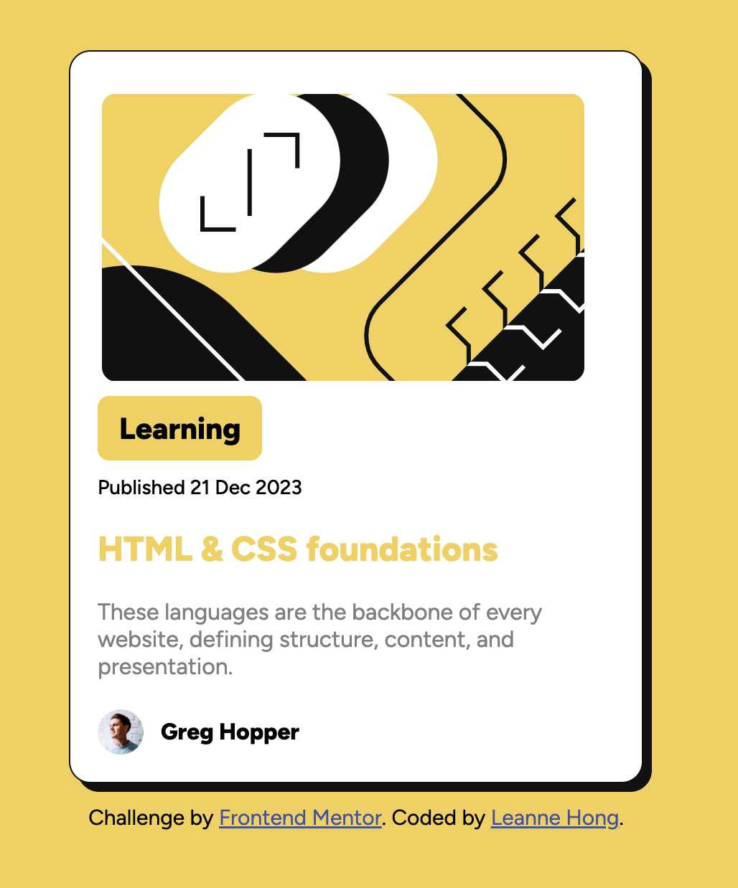

# Frontend Mentor - Blog preview card solution

This is a solution to the [Blog preview card challenge on Frontend Mentor](https://www.frontendmentor.io/challenges/blog-preview-card-ckPaj01IcS). Frontend Mentor challenges help you improve your coding skills by building realistic projects. 

## Table of contents

- [Overview](#overview)
  - [The challenge](#the-challenge)
  - [Screenshot](#screenshot)
  - [Links](#links)
- [My process](#my-process)
  - [Built with](#built-with)
  - [What I learned](#what-i-learned)
  - [Continued development](#continued-development)
- [Author](#author)

## Overview

### The challenge

Users should be able to:

- See hover and focus states for all interactive elements on the page

### Screenshot

When the link is hover or active

### Links
add soon
- Solution URL: [Add solution URL here](https://github.com/leannehong/Blog-Preview-Card)
- Live Site URL: [Add live site URL here](https://leannehong.github.io/Blog-Preview-Card/)

## My process

### Built with

- Semantic HTML5 markup
- CSS custom properties
- Flexbox
- CSS Grid

### What I learned

Learn and improving my HTML and CSS skills.

### Continued development

I want to focus more on Flexbox and CSS grid. I'm not the best at it but with time and improvement, I can grow. I'm probably going to try to recreate something simliar to this because I want to practice the concepts that I learn from this.

## Author

- Frontend Mentor - [@leannehong](https://www.frontendmentor.io/profile/yourusername)

